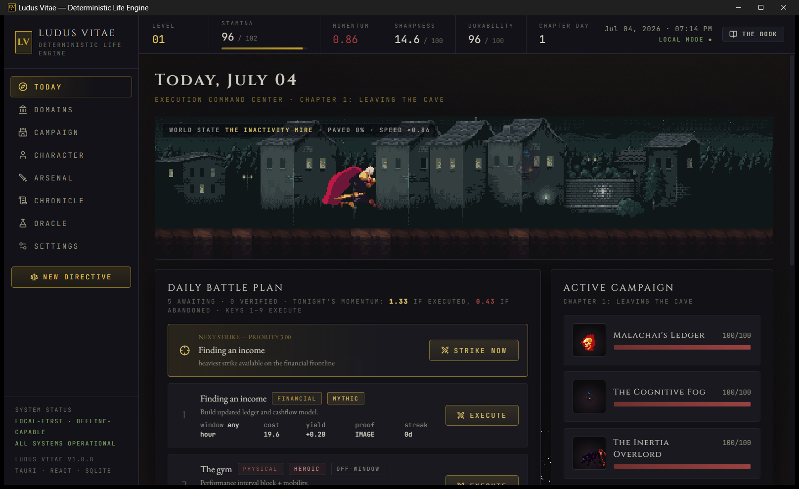
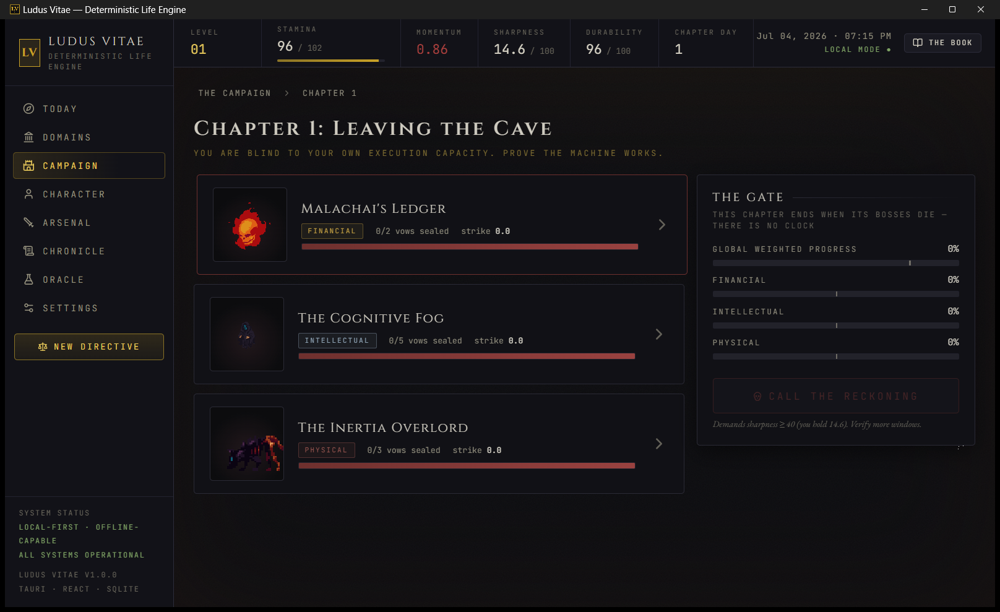
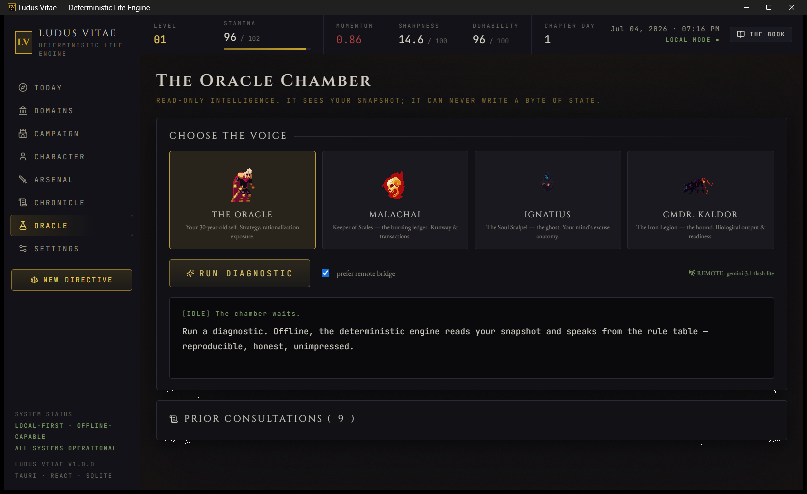
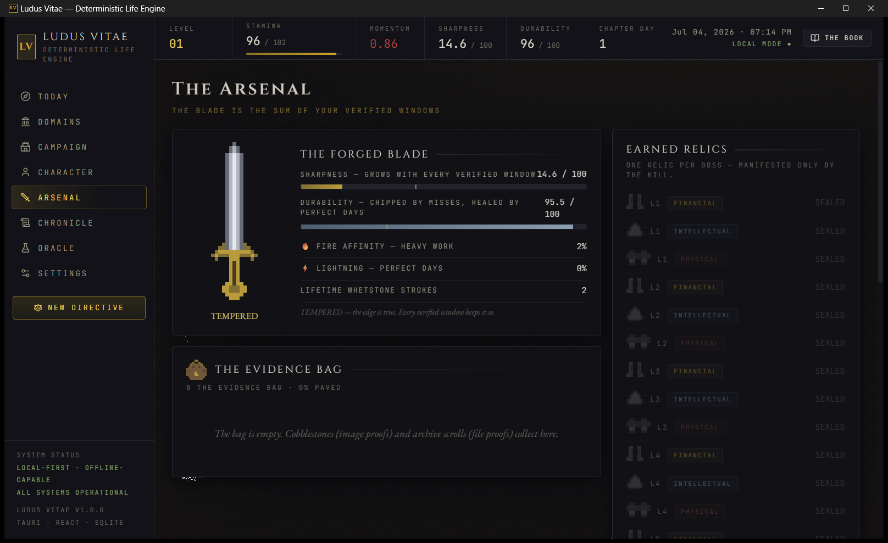
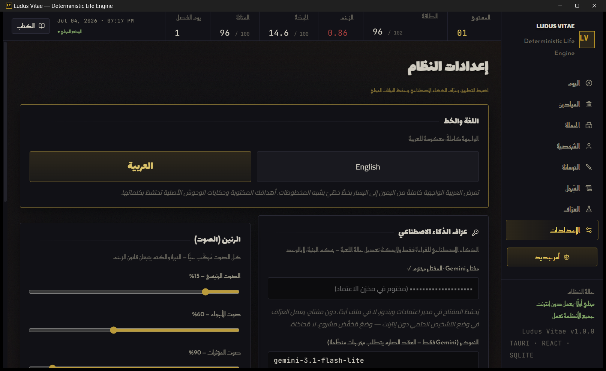

<div align="center">


# LUDUS VITAE

### The Deterministic Life Engine

*A local-first desktop RPG where the only thing you level up is your actual life.*

[](https://github.com/YARObHATEM/ludus-vitae/releases/latest)
[](LICENSE)
[](https://github.com/YARObHATEM/ludus-vitae/releases/latest)
[](https://tauri.app)
[](https://www.rust-lang.org/)

[**Download the latest release**](https://github.com/YARObHATEM/ludus-vitae/releases/latest) · [Wiki](https://github.com/YARObHATEM/ludus-vitae/wiki) · [Report a bug](https://github.com/YARObHATEM/ludus-vitae/issues)

</div>

---

## What this is

**Ludus Vitae is not a habit tracker.** Habit trackers ask you to check a box. This asks you to fight a war.

Your real life — the things you actually do, prove, and repeat — is the only input this engine accepts. Every rule that turns that input into momentum, stat growth, weapon sharpness, and boss damage is **fixed, deterministic mathematics** running entirely on your own machine. No cloud, no accounts, no telemetry. The AI layer (optional, Gemini-powered) is architecturally read-only: it can narrate your state and draft suggestions, but it can never write a single byte back into the database.

Ten chapters. Three bosses per chapter, each one a monster built out of a real failure mode — financial stagnation, cognitive avoidance, physical inertia. You don't grind XP against them directly: your daily discipline forges a **sword**, and only *provable, evidence-backed milestones* and the **Reckoning** (a repeatable, costly ritual strike) actually land damage. A chapter has no calendar — it ends when its bosses are dead, or when you choose to force the gate early and carry their survivors forward, mutated and cursed, into the next one.

<div align="center">

<br/><sub><b>Today</b> — the command center. The world strip is a live gauge: momentum &lt; 1.0 turns the road to mud and the interface itself desaturates.</sub>
</div>

---

## Table of Contents

- [Core pillars](#core-pillars)
- [Screenshots](#screenshots)
- [The math, briefly](#the-math-briefly)
- [Installing](#installing)
- [Building from source](#building-from-source)
- [Architecture](#architecture)
- [Tech stack](#tech-stack)
- [Project layout](#project-layout)
- [The Oracle (AI layer)](#the-oracle-ai-layer)
- [Bilingual: English & Arabic](#bilingual-english--arabic)
- [Roadmap](#roadmap)
- [Credits & licensing](#credits--licensing)

---

## Core pillars

| Pillar | What it means in practice |
|---|---|
| **Deterministic core** | SQLite is the single source of truth. Every formula lives in one Rust module (`formulas.rs`), unit-tested. Nothing in the UI ever re-derives game math. |
| **Verified execution** | Actions require proof — an honest manual check, an image, or a file — validated against the real filesystem. No proof, no state change. |
| **Visual consequence** | The world you walk through *is* your data. Terrain, weather, creatures, your avatar's own equipment — all derived live from the same snapshot. |
| **Open gates, no calendar** | A chapter ends when its bosses die. Forcing the gate early is a deliberate, costly choice (Ascended Debt: +35% HP and a stamina curse carried forward), not a clock ticking down. |
| **Read-only AI** | The Oracle and its three companion personas can diagnose and *propose* (e.g. draft milestones from a goal), but every write to the database is a direct, deterministic command — never a model's decision. |
| **Local-first, always** | Everything — save file, vault, evidence, API key (OS credential store) — lives on your machine. The engine runs fully offline; the AI layer degrades gracefully to a rule-based diagnostic mode with no key. |

---

## Screenshots

<div align="center">


<br/><sub><b>Campaign</b> — drill down from the ten-chapter ladder into a chapter's war room, then into any boss's own chamber.</sub>
<br/><br/>


<br/><sub><b>The Oracle Chamber</b> — four distinct voices, each a character, each strictly read-only over your state.</sub>
<br/><br/>


<br/><sub><b>The Arsenal</b> — the sword is not decoration. Its sharpness, durability, and elemental affinities are all live game state.</sub>
<br/><br/>


<br/><sub><b>Full Arabic mode</b> — one toggle mirrors the entire interface right-to-left with a dedicated calligraphic font stack.</sub>

</div>

---

## The math, briefly

Everything below is implemented, unit-tested, and documented live in-app under **The Book**.

- **Momentum** `M ∈ [0.25, 3.50]`, baseline `1.00`. Verified executions add a fixed amount by weight class (Trivial `+0.02` → Mythic `+0.20`). Missed windows are **multiplicative** (`M ×= 0.90^weight`) — losing hurts more than winning helps, on purpose.
- **Friction** — every consecutive miss on a directive compounds its stamina cost by roughly `×1.30`. Intelligence lowers that interest rate; momentum discounts it by `÷√M`.
- **The Whetstone** — daily directives never hit a boss directly. They forge sharpness on a logistic curve (a dull blade sharpens fast; a keen one slowly), weighted by sector — Financial carries `×1.5`, the frontline of the whole campaign.
- **The Siege** — a directive can be *sworn* to a living boss. Every execution then chips it directly, capped at 20% of its total health. Pressure, not a kill switch.
- **The Reckoning** — a repeatable ritual strike, gated behind a sharpness floor and a 7-day cooldown, that resolves the chapter: `strike = sharpness × durability_factor × (1 + affinities) × M^0.25 × √(sector_completion) − armor`.
- **The Gate** — a chapter ends cleanly when every boss is dead. It can also be *forced* once global progress ≥ 80% and every sector ≥ 50%, at the cost of Ascended Debt for whatever survives.

---

## Installing

Grab the installer from the **[latest release](https://github.com/YARObHATEM/ludus-vitae/releases/latest)** — `Ludus-Vitae_x64-setup.exe` — run it, and launch Ludus Vitae from the Start menu. No dependencies, no runtime to install separately; the Rust core and WebView are bundled.

First launch opens **The Genesis Ritual** — a one-time founding ceremony where you name your directives, your milestone vows, and enter Chapter 1. There is no reset button by accident; deleting your save is a deliberate, confirmed action in Settings.

> Windows SmartScreen may warn about an unsigned installer on first run — this is expected for an indie, unsigned binary. Click **More info → Run anyway**.

## Building from source

```bash
git clone https://github.com/YARObHATEM/ludus-vitae.git
cd ludus-vitae
npm install

# Development (hot reload)
npm run tauri dev

# Production build — produces the NSIS installer under
# src-tauri/target/release/bundle/nsis/
npm run tauri build
```

**Prerequisites:** Node.js 18+, Rust (stable toolchain), and the [Tauri v2 prerequisites](https://v2.tauri.app/start/prerequisites/) for your platform (on Windows: the MSVC Build Tools + WebView2, which ships with Windows 11 by default).

Run the test suite (36 tests covering every formula and the full execution pipeline — genesis, sieges, misses, the Reckoning, forced gates, resets):

```bash
cd src-tauri
cargo test
```

---

## Architecture

```
┌─────────────────────────────────────────────────────────────────┐
│  React shell (src/)             — composition, overlays, i18n   │
│  PixiJS world (locomotionScene) — the living strip, pure render │
│  WebAudio engine                — procedural, momentum-driven   │
└───────────────────────────┬───────────────────────────────────-─┘
                             │ typed Tauri commands (IPC)
┌───────────────────────────▼───────────────────────────────────-─┐
│  Rust / Tauri core (src-tauri/)                                 │
│  • SQLite (WAL) — the single source of truth                    │
│  • formulas.rs  — every game law, pure & unit-tested             │
│  • engine.rs    — the only place state is mutated                │
│  • oracle.rs    — Gemini bridge, strict JSON contract,           │
│                    read-only by construction                     │
└───────────────────────────────────────────────────────────────-─┘
```

The frontend never reconstructs game math and never has direct write access to anything — every mutation, from executing a directive to burning the world in a reset, is a single typed Rust command that validates, computes, and commits inside a transaction.

## Tech stack

| Layer | Technology |
|---|---|
| Shell | [Tauri v2](https://tauri.app) (Rust core + native WebView) |
| UI | React 18, TypeScript, Vite |
| World rendering | [PixiJS](https://pixijs.com) 8 |
| Database | SQLite via `rusqlite` (WAL mode) |
| AI bridge | Google Gemini (`gemini-2.5-flash` by default), strict JSON schema |
| Audio | Procedural WebAudio — zero shipped audio assets |
| Art | [Gothicvania](https://ansimuz.itch.io/) pixel art by **Ansimuz** (CC0) |

## Project layout

```
src/                    React frontend
├─ pages/               Today, Domains, Campaign, Character, Arsenal,
│                       Chronicle, Oracle, Settings, Genesis Ritual
├─ components/          Shared UI, pixel-art sword/bag, The Book (manual)
├─ engine/               PixiJS locomotion world
├─ audio/                Procedural sound engine
├─ i18n/                 English/Arabic dictionary + RTL provider
└─ state/                Snapshot store, one read-model for the whole app

src-tauri/src/          Rust core
├─ formulas.rs           The Iron Laws — all game math, unit-tested
├─ engine.rs             Execution pipeline, night-close algorithm,
│                        Reckoning, Gate, siege, Genesis seeding
├─ oracle.rs             Read-only Gemini bridge + offline diagnostics
├─ snapshot.rs           Assembles the single read-model
├─ db.rs                 Schema, migrations, reset
└─ integration_tests.rs  Full-pipeline tests
```

## The Oracle (AI layer)

Four personas, four pixel-art familiars, one hard rule: **read-only, always.**

- **The Oracle** — your 30-year-old self, strategic overview.
- **Malachai** — the burning ledger, your financial front.
- **Ignatius** — the drifting ghost, your mind's excuses.
- **Cmdr. Kaldor** — the hound, your body's discipline.

Without an API key, all four run on a deterministic, offline rule-table — reproducible, honest, and free forever. Seal a Gemini key (Settings → stored in the OS credential manager, never a file) to let them speak live, or to let the Oracle **draft milestone proposals** from a goal you describe — which you then edit and forge yourself. The model never gets write access; it only ever proposes rows you confirm.

## Bilingual: English & Arabic

Settings → Language & Script flips the *entire* application, not just labels: sidebar moves to the right, layout mirrors right-to-left, and the interface switches to a bold, high-legibility Arabic font stack (Lalezar for display, Cairo for body, Reem Kufi for UI labels) instead of a thin default system font. Your own typed goals and the canonical boss lore keep their original language by design.

## Roadmap

- [ ] macOS / Linux Tauri bundles
- [ ] Translate the remaining engine-generated strings (boss lore, night-ledger event log) into Arabic
- [ ] Signed installer
- [ ] Steam Deck / handheld layout pass

See the [Wiki](https://github.com/YARObHATEM/ludus-vitae/wiki) for the full mechanics reference and the maintainer's own running notes.

## Credits & licensing

- World and creature pixel art: the **Gothicvania** collection by [Ansimuz](https://ansimuz.itch.io/) (CC0 — free for any use).
- Fonts via [Fontsource](https://fontsource.org/): Cinzel, EB Garamond, JetBrains Mono, Lalezar, Cairo, Reem Kufi.
- Everything else — original code, licensed under [MIT](LICENSE).

---

<div align="center">
<sub>Built for one person's actual life. Released in case it's useful for yours.</sub>
</div>
